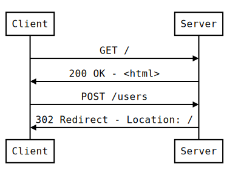

# W6D3 - WebSockets & Real Time Communication (RTC)

## Running the Example.

Make sure to clone the repo before starting any of the steps before

### Front-end

1. `cd` to the project root directory
2. `npm install`
3. `npm start`

### Back-end

1. `cd` to the `ws-server` directory
2. `npm install`
3. `npm start`/`npm start:dev` (`start:dev` runs with nodemon)

## Review

### HTTP

HTTP follows a Request/Response cycle, every Response has a Request that initiated the Response:



HTTP is also a unidirectional protocol, the server has no knowledge of the client until a request comes in, so we have no way to send information to a client unless a request comes in first.

## WebSockets

WebSockets allow for a full duplex connection to a server, this allows the server to communicate to the clients even if they don't make a request. This does require that the clients connect first to the Socket Server to first open this "tunnel", after which the client can receive messages from the server.


There are only 2 types of data we can send over a WebSocket:

- Strings
- Binary Data

That means if we want to send some more complicated objects over the WebSocket, we first have to `JSON.stringify` our objects, then `JSON.parse` the resulting String message on our server.

A similar process happens on the client side.

### Sequence Diagram


## Setting up the server

While the browser has access to the native [`WebSocket`][web-socket-mdn] API, Node does not. Therefore we need to reach out to a library/package to help us with that.

There are many WebSocket libraries out in the wild, such as socket.io, however things like socket.io are a little bit of overkill for what we need, we'll be using the [`ws`][ws-npm] package instead.

`ws` provides both a Client and a Server, which means you could connect to a socket server through Node using this library as well. However in this example we'll just be using the Server.

As always, `ws` can be installed through npm: `npm i --save ws`

### Basic Setup

`ws` lets us setup a socket server without anything else and is fairly simple to setup:

```javascript
const WebSocket = require('ws');
const SocketServer = WebSocket.Server;

const wss = new SocketServer({ port: 8080 });

wss.on('connection', function connection(ws) {
  ws.on('message', function incoming(message) {
    console.log('received: %s', message);
  });

  ws.send('something');
});
```

### With Express

Using `ws` with `express` is a little more complicated and requires us to use Node's HTTP server API to connect the two:

```javascript
const WebSocket = require('ws');
const SocketServer = WebSocket.Server;
const express = require('express');
const http = require('http');

// Create our express app
const app = express();

// Setup some routes
app.get('/', (req, res) => {
  res.send('Hello, World!');
});

// Create a plain HTTP server using the express server as a base
const server = http.createServer(app);

// Create our socket server on top of the HTTP server
const wss = new SocketServer({ server });

wss.on('connection', function connection(ws) {
  ws.on('message', function incoming(message) {
    console.log('received: %s', message);
  });

  ws.send('something');
});

// Make sure our server is listening
server.listen(8080, () => {
  console.log('Server is listening on http://localhost:8080');
});
```

### Other Examples

The [`ws`][ws-npm] package contains a bunch more examples for you to peruse.

## Usage With React

When working with WebSockets in React, we need to first think about where our socket connection will live. Usually this is in one of our top most components (e.g. `App.jsx`)

This is also where our life cycle methods come into play.

In the example we worked through in class, we used the `componentDidMount` life cycle function to setup the WebSocket connection and all of the event listeners we care about:

```javascript
class App extends React.Component {
  // ...

  componentDidMount() {
    this.socket = new WebSocket('ws://localhost:3001');

    // This event listener is fired when the socket is opened (i.e. connected)
    this.socket.onopen = () => {
      console.log('Client connected');
    };

    // This event listener is fired whenever the socket receives a message from the server
    // The parameter e is a MessageEvent which contains the message from the server along with some metadata.
    this.socket.onmessage = e => {
      // the actual message from the server is contained in the `data` key
      console.log(`Got message from the server: ${e.data}`);
    };

    // This event listener is fired when the socket is closed (either by us or the server)
    this.onclose = () => {
      console.log('Client disconnected');
    };
  }

  // ...
}
```

# Resources

- [Code from lecture](https://github.com/daegren/lhl-web-w6d3-nov26-websocket-demo)
- [WebSocket MDN][web-socket-mdn]
- [`ws` package][ws-npm]
- [Reactjs: Component Life Cycle](https://reactjs.org/docs/react-component.html#the-component-lifecycle)

[web-socket-mdn]: https://developer.mozilla.org/en-US/docs/Web/API/WebSocket
[ws-npm]: https://npmjs.org/packages/ws
